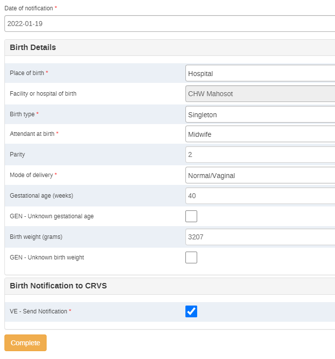
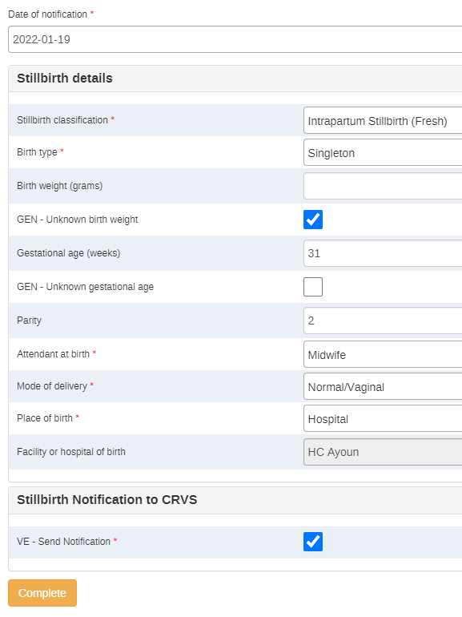
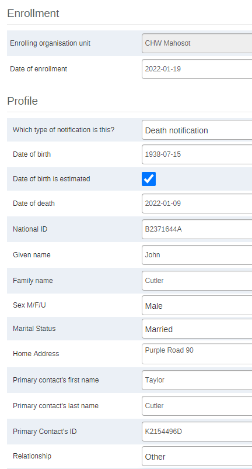
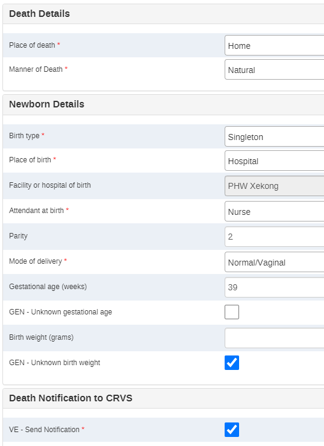

# Vital Events - Tracker System Design Guide { #crvs-ve-design }

## Introduction

Achieving the health-related targets of the Sustainable Development Goals (SDGs) will require strong and resilient health systems. The health information system is one of the six essential building blocks of health systems. The realization of better health outcomes for women, adolescents, and children is dependent upon well-informed and timely decisions and actions taken by health system managers and policymakers. Investing in improving Civil Registration and Vital Statistic (CRVS) is key to advancing the reporting of health-related SDG #3 indicators.

Notwithstanding the importance of the availability of vital statistics, the uneven implementation of civil registration systems is the outcome of multiple barriers, such as distance and accessibility, direct and indirect out-of-pocket costs, lack of knowledge, and cultural factors that disadvantage sub-populations such as women or migrants.

The Vital Events (VE) Tracker is a tool designed to increase the availability and the use of reliable data with the purpose of reinforcing the performances of health systems. The tracker module provides the opportunity to improve timeliness and accuracy of data, and to expand coverage of the reporting of core events such as birth, stillbirths, and death, by triggering real time notifications directly from the point of care. Notifications alone will not replace the official National CRVS or the legal framework of implementing countries, but they will improve and strengthen the foundation of a reliable demographic statistical repository.

This package was developed in response to an expressed need from the UNICEF, GAVI, and WHO joint statement in which all agencies reaffirmed their commitment to the SGDs and vulnerable populations, especially women and children, by working together with governments and partners to strengthen CRVS systems. The design is based on the UNICEF’s Guidance for health programme policy-makers, managers and development partners on [HEALTH SECTOR CONTRIBUTIONS TOWARDS IMPROVING THE CIVIL REGISTRATION OF BIRTHS AND DEATHS IN LOW-INCOME COUNTRIES](https://apps.who.int/iris/handle/10665/341911)

This document is intended for use by DHIS2 implementers at country and regional level to be able to support implementation and localization of the version 1.1.0. of the package. Local work flows, national guidelines, and the respective vaccination product guidelines should be considered during the configuration and adaptation of this package.

## System Design Overview

### Use case

The overall objective is to promote children and women’s rights as well as evidence-based planning and programming through the strengthening of in-country population data by accelerating live birth, stillbirth, death notification/registration completeness.

The tracker data model in DHIS2 enables an individual to be registered and followed across a series of health services provided over time. This model can be leveraged to track individuals’ completion of vaccination schedules according to national policy and product recommendations, as well as capture robust individual level data to support analysis of vaccine distribution, uptake, and completion according to demographics, underlying conditions, and other variables.

### Intended users

- Clinical users: the Vital Events tracker program is optimized for data entry at Point of Care.
- Facility Managers, District Health Offices and National Program Staff: the data generated through the programme feeds into a standardised dashboard monitoring the key indicators for each vital event.

### Information flow

While the workflow around the registration of the vital event will vary from country to country, the tracker has been designed following the information flow in the flowchart above.

Each vital event will go through an enrollment process. Depending on the event itself, a birth, stillbirth, or death event will each require stage-specific information. Finally, once all the data has been entered in the system, the user can send a real time notification to the CRVS and the reported contacts via either SMS, system notification, or data exchange.

Standard data analyses in the form of predefined dashboards will be available from the information encoded in the enrollment and the different stages. The analytics will also give the possibility to link this package to other DHIS2 packages for data triangulation analysis (e.g. the immunization registry, the HIV tracker, or the cause of death just to name a few) if they are installed in the same instance.

### Version 1.0.0. vs version 1.1.0. 

The design of the Vital Events tracker program has been reviewed and adjusted to improve its flow of information and the end-user experience. 
The differences between the baseline and version 1.1.0. can be found in the [Vital Events Diff File](resources/VE_diff_1.0vs1.1_en.xslx) and in [Jira](https://jira.dhis2.org/browse/METRGDHIS2-568).

## Tracker Program Configuration

|Structure|Description|
|--- |--- |
|1.Enrollment|First step of the program. In the profile section the user will have to provide the information on the type of notification (birth, death, stillbirth) in order to proceed onto the next stage.|
|2. Birth details OR Death details OR Stillbirth details|The second step of the program. The information required in order to send the notification is stage-specific depending on the selected outcome in enrollment. The death notification is further differentiated depending on the age of the deceased (below or above 28 days).|

Please note that all the TEAs and DEs have been set as **compulsory** when entering data. This decision has been made to increase the completeness and quality of the notification data, and to ensure a proper review of the package’s model upon implementation as local adaptations can potentially affect other DEs or TEAs.

### Data elements 

the full list of Data Elements present in teh default configuration of this package is available in the [Vital Events Flat File](resources/VE_FlatFile_en.xlsx). The DEs in the package can be expanded in order to better reflect the local needs and the CRVS policies. Please make sure you consult the [Common Tracker Library](https://docs.dhis2.org/en/topics/metadata/dhis2-who-digital-health-data-toolkit/shared-metadata-library.html) before adding more data elements or TEAs, as some you are planning to integrate in the program might be also categorized as GEN - .

### Program Stages’ details

#### Enrollment

The enrollment stage expands based on the selection of the desired type of notification - birth, death, or stillbirth. Nonetheless, the majority of the Tracked Entity Attributes (TEAs) requested in the profiles for the different types of notifications are the same. More details are avialable in the chapters describing the three noifications.

The TEAs in the profile section of the Enrollment stage can be expanded in order to mirror the local regulations and required information - e.g. there can be an addition of a unique identifier, or of the information about the responsible staff for a given facility.

Please make sure you consult the [Common Tracker Library](https://docs.dhis2.org/en/topics/metadata/dhis2-who-digital-health-data-toolkit/shared-metadata-library.html) before adding more data elements or TEAs, as some you are planning to integrate in the program might be also categorized as GEN - .

#### Birth enrollment

At this point baby Olivia has been enrolled in the system, but the notification has not been sent yet.
>Note: the Sex DE displays only the Male and Female options in the Birth Enrollment stage. 

#### Birth details stage

The second stage of the program, “Birth details” will request more information about the baby and the delivery. Olivia’s birth notification will only be sent to the CRVS and the contacts’ numbers if:

- “Send notification” is ticked
- All required data points are filled in
- The stage will be marked “complete”.

   The data elements reported in this stage and options available in dropdown lists can be changed/reduced/increased according to the local context.

> **Note**
>
> The automatic warnings are triggered whenever the birth weight exceeds the upper and the lower guideline limits. The lower threshold for the warning trigger has been set at 2500 g, whereas the upper limit has been set at 4500 g. This warning has been set purely to avoid data entry mistakes such as mistyping or mixing of weight units (kg instead of g). Please note that the warning message does not imply the health status of the newborn.
> Should the notification not have info on the gestational weeks and the weight of the newborn, the user should tick the boxes provided - rules have been set to prevent the completion of the stage if the data element (e.g. Gestational age) and its correspondent unknown data element (Unknown gestational age) are either both filled, or both blank. This is of particular important for the reporting of unknonwn variables - the program indicators measuring the numbers of unkonwn gestational age and unknown weight are only weighting the number of boxes that have been ticked, not if the weight or gestational age are left empty as a proxy for unknown information. 

#### Stillbirth enrollment

 At this point the baby boy has been enrolled in the system, but the notification has not been sent yet. As the boy had not been named yet, he was reported as per the warning under the “Given Name” TEA. The warning will appear by default whenever “stillbirth” is selected as a type of notificatio, though it can be adapted or removed according to local policies and guidelines.

 

> **Note**
>
> Stillbirth Enrollment is the only stage where the **"Unknown" option** is available for the reporting of the sex of the tracked entity.

#### Stillbirth details stage

The second stage of the notification process for a stillbirth will request more information about the delivery and the deceased baby.

Just as for the birth notification stage, there are some automatic warnings set up to better guide the data entry. The warnings are triggered whenever the information provided falls out of normal ranges. They do not provide medical guidance, rather just a reminder to be particularly attentive when entering these data.

- The **automatic warnings** are triggered whenever:

1. The *stillbirth gestational age is lower than 22 weeks*. This **placeholder warning** is set at 22 weeks as the lower limit: as per international standards, a death can be classified as a stillbirth after 22 weeks. If any other national guidelines have different thresholds (e.g. 20 weeks) the threshold can be changed accordingly. If there is no threshold on the weeks set locally, a different warning could be configured for the weight with a threshold set at 500 grams.

2. The *birth weight exceeds the upper and the lower guideline limits*. The lower threshold for the warning has been set at 2500 g, whereas the upper limit has been set at 4500 g.

3. The user fills in **both or neither** the data element and its correspondent unknown tick option.

#### Death enrollment

The death notification differs depending on the age of the deceased.

##### Enrollment of a death occurring > 28 days after birth

John died at the age of 83 years. The son and main contact, Taylor, was not sure about his father’s birthday. The data clerk has therefore ticked the “Date of birth is estimated” box.

> **Note**
>
> 1. an automatic warning message (same message as the one appearing for the name of stillbirths) will appear below the Given Name TEA for all the deaths of children occurring within the first year of life (set as a placeholder). The warning message or the threshold can be changed or removed according to local guidelines.
> 2. The Sex data element only presents the "Male" and "Female" options.

##### Death details of a death occurring > 28 days after birth

The information requested in the death details stage is minimal. Please note that in case definitions are not clear (e.g. Manner of death), the data entry operator will be able to access the definitions of the DEs just by clicking on them in the data entry form.

##### Enrollment of a death occurring ⩽ 28 days after birth

A baby girl died a couple of weeks after birth. She had not been given a name yet, so for the purpose of the enrollment itself, she will be recorded according to the warning reported in the screenshot below. The warning and its context can be modified according to the local contexts and regulations.

##### Death details of a death occurring ⩽ 28 days after birth

The information requested in the “Death details “ stage is more similar to the data requested for a birth or a stillbirth notification, than just a death.

The data elements reported in this stage and options available in dropdown lists can be changed/reduced/increased according to the local context.

> **Note**
>
> The automatic warning is triggered whenever the birth weight exceeds the upper and the lower guideline limits. The lower threshold for the warning trigger has been set at 2500 g, whereas the upper limit has been set at 4500 g. This warning has been set purely to avoid data entry mistakes such as mistyping or mixing of weight units (kg instead of g). Please note that the warning message does not imply the health status of the newborn information as a 2500 gram newborn could easily be a healthy baby.

## User groups

|     User group    |     Dashboard     |  Program metadata |     Program data     |
|:-----------------:|:-----------------:|:-----------------:|:--------------------:|
| VE - Admin        | Can edit and view | Can edit and view | Can view only        |
| VE - Access       | Can edit and view | Can view only     | Can view only        |
| VE - Data capture | No Access         | Can view only     | Can capture and view |
**These should be adapted depending on the local context.**

## Realtime notifications

DHIS2 has an SMS notifications module, but in order to use the notifications, an SMS gateway needs to be configured. See documentation on sms gateways here: [https://docs.dhis2.org/master/en/developer/html/webapi_sms.html](https://docs.dhis2.org/master/en/developer/html/webapi_sms.html)

The programme includes a message to be sent to the registered contact(s) of the notified life event:

“Thank you for notifying the National Civil Registration and Vital Statistics program of this XXX”

XXX being equal to stillbirth, birth, or death depending on the completed notification.

In addition to sending an SMS as the result of evaluating a program rule, DHIS2 can also send SMS or emails that can be triggered by other events, including system or background job failures and validation analysis results. Feedback handling tools are also available for validation results and the priority will be set to the importance of the validation rule violated.

This can be setup under Maintenance -> Program -> Program Notification / Program Stage Notification.

The following options are available when a choosing recipient:

In order to send a notification via SMS, we have created a Tracked Entity Attribute called “Mobile phone” which can be selected as a “Program attribute” to be used as recipient.

## Analytics

The full list of program indicators and indicators is available in the [Vital Events Flat File](VE_FlatFile_en.xslx).
**Please mind that all the indicators’ calculations use only the notified births/deaths/stillbirths, not the enrolled ones**. This choice has been made in order to easily detect discrepancies in the system between enrollments without final notifications and the total number of notified events; and in order to align with the nature of the program itself - notifications.

> **Note**
>
> The 2 months threshold present in some of the analytics has been set as a placeholder for the legal period of notification. The time period will have to be adapted locally according to the National Guidelines

## Dashboards

The package has three predefined dashboards: one for Births, one for Deaths, and one for Stillbirths. All of them give a general overview on the aggregate numbers of information related to the specific cause of notification.

**Birth dashboard** - geographic distributions of notified cases, aggregated total of key indicators, discrepancy table, birth rates, stage-specific information (e.g. attendant at birth, place of birth)

**Death dashboard** - geographic distribution of notified cases, all the key mortality rates, totals of key indicators for monitoring, stage-specific information (e.g. sex of the deceased, place of death), missing information.

**Stillbirth dashboard** - geographic distribution of the notified stillbirths, aggregate date on the key indicators, stillbirth rate, stage-specific information (e.g. type of stillbirth, overview of the gestational weeks, missing information).

## Triangulation of data coming from other packages

The purpose of this section is to highlight the specific stages and sections of the packages in which a life event gets recorded, and propose additional data elements in order to triangulate the data against the notifications sent from the VE program.

Proposed Additional Data Elements:

1. *Has this birth/death/stillbirth been notified and registered in the national CRVS system? Y / N / Unknown*

    IF NO

2. *Is this birth/death/stillbirth being notified at the present moment? Y / N*

Here below is a list of the programs and the possible linkages that are recommended to triangulate the data and to obtain extra information on missed opportunities of notifications. As a result, the triangulation of information could help the health system with the improvement of their demographic statistics.
As a general principle the VE data can be triangulated against any tracker package that contains and reports information on any of the vital events - births, deaths, and stillbirths.

### Adverse events following immunisation (AEFI) tracker

The data collected in this tracker that could be potentially triangulated with the VE tracker are the deaths following an AEFI.

A question regarding the notification of death could be added to the AEFI tracker once the National Level program stage has been completed and the AEFI stage appears.

If “Death” is the selected outcome, the information on whether the patient’s death has been reported and, in case of a negative answer, whether the death is getting notified now could go after the question on the autopsy.

If the questions are added to the AEFI tracker, some extra indicators could be configured in order to have a better overview of the degree of potential missed opportunities of notification:

- Number of AEFI-related deaths reported as unregistered
- Number of death notifications sent at the time of completion of the National Level evaluation

### TB Case Surveillance

The TB case surveillance tracker follows the patient from the detection of a TB infection up to the outcome of the treatment.

If in the “Outcome” stage the patient is reported as dead, the supplementary information about the possible death notification can be reported after the DE “TB treatment outcome”.

If the questions are added to the TB case surveillance tracker, some extra indicators could be configured in order to have a better overview of the degree of potential missed opportunities of notification:

- Number of unnotified TB-related deaths
- Number of death notifications sent at the time of TB outcome completion

## Resources

[Health sector contributions towards improving the civil registration of births and deaths in low-income countries: guidance for health sector managers, civil registrars and development partners](https://apps.who.int/iris/handle/10665/341911)
